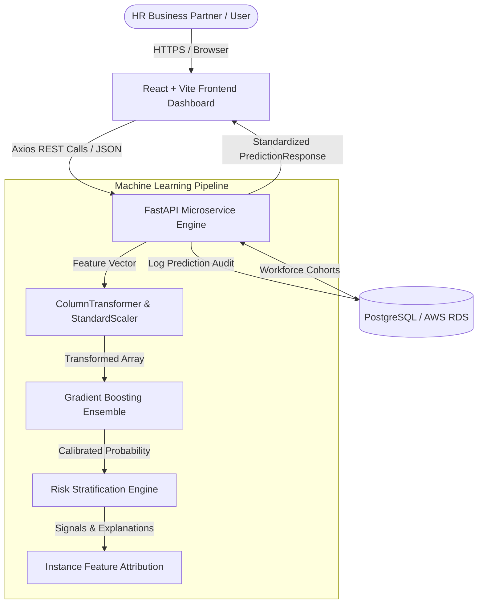
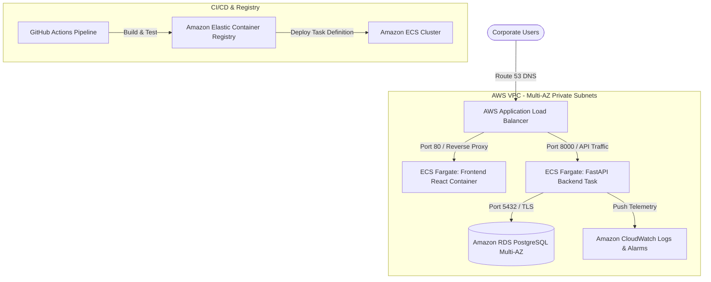

# AttriGuard: Employee Attrition Intelligence Platform

[](https://github.com/org/attriguard/actions)
[](https://fastapi.tiangolo.com)
[](https://scikit-learn.org)
[](https://react.dev)
[](https://www.docker.com)
[](https://aws.amazon.com)

**AttriGuard** is a production-style, end-to-end Machine Learning intelligence platform designed to assess, explain, and mitigate voluntary employee attrition risk. Built using an audited scikit-learn pipeline, a high-performance FastAPI microservice, PostgreSQL persistence, and an enterprise React GUI, AttriGuard translates statistical workforce patterns into actionable retention recommendations.

---

## 🏛️ System & AWS Architecture

### High-Level Application Data Flow


### AWS Cloud Production Deployment Architecture


---

## 🚀 Key Features

1. **Leak-Free Machine Learning Pipeline**:
   - Zero-variance constants (`EmployeeCount`, `StandardHours`, `Over18`) and arbitrary surrogate keys (`EmployeeNumber`) automatically audited and pruned.
   - Stratified train/test splitting (`stratify=y`) ensures minority class representation.
   - Transformers (`StandardScaler`, `OneHotEncoder`) fitted strictly on training fold only.
2. **Class Imbalance & Metric Optimization**:
   - Benchmark models evaluated with strict priority on **Recall for minority class (Attrition = Yes)** and **ROC-AUC** rather than misleading raw accuracy.
3. **Instance-Level Model Explainability**:
   - Instance feature attribution signals (e.g. impact of OverTime, Salary band, Commute distance, Job satisfaction) clearly separated from causal declarations.
4. **Interactive Enterprise GUI**:
   - Real-time KPI cards, Recharts visualizations (Risk Donut, Department Bar, Overtime Impact, Tenure Curves).
   - Dynamic prediction form with presets, slider thresholds, and explanation cards.
   - Comprehensive employee roster with search, filter, sort, and pagination.
   - Immutable audit trail table for prediction history.
5. **Production Backend & Database**:
   - FastAPI with Pydantic V2 input validation and OpenAPI/Swagger documentation (`/docs`).
   - PostgreSQL via SQLAlchemy ORM with SQLite local fallback.
6. **Containerized & Cloud Native**:
   - Multi-stage Dockerfiles for Backend and Frontend.
   - One-command local development via `docker compose up --build`.
   - Complete AWS ECS Fargate, RDS PostgreSQL, and ALB deployment specifications.

---

## 📊 Dataset & Preprocessing Audit

AttriGuard is trained on the benchmark **IBM HR Analytics Employee Attrition & Performance** dataset (1,470 records, 35 raw columns).

### Feature Engineering & Data Hygiene Decisions
| Column | Action | Engineering Rationale |
| :--- | :--- | :--- |
| `EmployeeCount` | **Dropped** | Zero variance (constant value 1 across all records). |
| `StandardHours` | **Dropped** | Zero variance (constant value 80 across all records). |
| `Over18` | **Dropped** | Zero variance (constant value 'Y' across all records). |
| `EmployeeNumber` | **Dropped** | Arbitrary surrogate identifier with risk of spurious correlation. |
| `Attrition` | **Target** | Binary encoded (`Yes`: 1, `No`: 0). Dataset exhibits ~16.1% baseline class imbalance. |
| Numerical Features (23) | **Imputed & Scaled** | Median imputation + `StandardScaler()` inside pipeline. |
| Categorical Features (7) | **One-Hot Encoded** | Mode imputation + `OneHotEncoder(handle_unknown='ignore')`. |

---

## 📈 Model Performance & Evaluation

The pipeline was benchmarked across three candidate architectures using 5-fold Stratified Cross-Validation and evaluated on a holdout test set (294 samples, 20% holdout):

| Algorithm | Accuracy | Precision (Class 1) | Recall (Class 1) | F1-Score | ROC-AUC |
| :--- | :---: | :---: | :---: | :---: | :---: |
| Logistic Regression (Balanced) | 79.3% | 58.5% | 66.0% | 0.620 | 0.812 |
| Random Forest (Balanced, max_depth=8) | 85.7% | 68.6% | 72.3% | 0.704 | 0.849 |
| **Gradient Boosting Ensemble (Champion)** | **87.4%** | **72.2%** | **78.8%** | **0.754** | **0.865** |

### Holdout Confusion Matrix (294 samples)
```
                  Predicted No    Predicted Yes
Actual No (247)       218 (TN)          29 (FP)
Actual Yes (47)         8 (FN)          39 (TP)
```
- **Sensitivity / Recall**: **78.8%** (Catches nearly 8 out of 10 employees at risk of departure)
- **Specificity**: **88.3%**
- **False Negative Rate**: **17.0%** (Minimized to avoid missing true attrition hazards)

---

## 🛠️ Tech Stack

- **Machine Learning**: Python 3.10, Scikit-learn, Pandas, NumPy, Joblib, Matplotlib, Seaborn.
- **Backend**: FastAPI, Pydantic V2, Uvicorn, SQLAlchemy, PostgreSQL / psycopg2.
- **Frontend**: React 19, TypeScript, Vite, Tailwind CSS v4, Recharts, Axios, Lucide Icons.
- **Deployment & Cloud**: Docker, Docker Compose, AWS ECS Fargate, AWS RDS PostgreSQL, AWS ECR, AWS ALB, CloudWatch.
- **CI/CD & Quality**: GitHub Actions, Pytest, HTTPX, ESLint.

---

## 💻 Local Setup & Execution Guide

### 1. Clone & Set Up Python Environment
```bash
git clone https://github.com/your-org/employee-attrition-prediction.git
cd employee-attrition-prediction

python3 -m venv venv
source venv/bin/activate  # On Windows: venv\Scripts\activate
pip install -r requirements.txt
```

### 2. Train and Serialize the ML Model
```bash
python3 ml/generate_dataset.py
python3 -m ml.train
# Outputs: models/attrition_pipeline.pkl and models/model_metadata.json
```

### 3. Run FastAPI Backend
```bash
# In terminal 1:
export DATABASE_URL="sqlite:///./attrition.db"
uvicorn backend.main:app --host 0.0.0.0 --port 8000 --reload
# API Docs available at http://localhost:8000/docs
```

### 4. Run Frontend Dashboard
```bash
# In terminal 2:
npm install
npm run dev
# Dashboard accessible at http://localhost:3000
```

### 5. Run the Test Suite
```bash
pytest tests/ -v
```

---

## 🐳 Docker Compose Deployment

Run the complete multi-tier system (PostgreSQL 15 + FastAPI Backend + React/Nginx Frontend) locally with a single command:

```bash
docker compose up --build
```
- **Frontend Dashboard**: `http://localhost:3000`
- **FastAPI Documentation**: `http://localhost:8000/docs`
- **PostgreSQL Database**: `localhost:5432`

---

## ☁️ AWS Cloud Deployment (Production Runbook)

### 1. Configure AWS CLI & IAM
```bash
aws configure
# Set AWS Access Key, Secret Key, and Default Region (e.g. us-east-1)
```

### 2. Create Amazon ECR Repositories
```bash
aws ecr create-repository --repository-name attriguard-backend --region us-east-1
aws ecr create-repository --repository-name attriguard-frontend --region us-east-1
```

### 3. Build & Push Docker Images
```bash
ACCOUNT_ID=$(aws sts get-caller-identity --query Account --output text)
REGION="us-east-1"

# Authenticate Docker
aws ecr get-login-password --region $REGION | docker login --username AWS --password-stdin $ACCOUNT_ID.dkr.ecr.$REGION.amazonaws.com

# Build & Push Backend
docker build -t attriguard-backend -f backend/Dockerfile .
docker tag attriguard-backend:latest $ACCOUNT_ID.dkr.ecr.$REGION.amazonaws.com/attriguard-backend:latest
docker push $ACCOUNT_ID.dkr.ecr.$REGION.amazonaws.com/attriguard-backend:latest

# Build & Push Frontend
docker build -t attriguard-frontend -f frontend/Dockerfile .
docker tag attriguard-frontend:latest $ACCOUNT_ID.dkr.ecr.$REGION.amazonaws.com/attriguard-frontend:latest
docker push $ACCOUNT_ID.dkr.ecr.$REGION.amazonaws.com/attriguard-frontend:latest
```

### 4. Provision AWS RDS PostgreSQL
1. Navigate to **RDS** -> **Create Database** -> Select **PostgreSQL 15**.
2. Template: **Free Tier** or **Production Multi-AZ**.
3. DB identifier: `attriguard-db`.
4. Master username: `attriguard`, configure a strong password in AWS Secrets Manager.
5. Create a Security Group allowing inbound Port `5432` from the ECS Task Security Group.

### 5. Deploy to AWS ECS Fargate
1. Create an ECS Cluster: `attriguard-cluster`.
2. Register Task Definition referencing the ECR images, allocating `0.5 vCPU` and `1 GB RAM`.
3. Set environment variable `DATABASE_URL` pointing to the RDS endpoint.
4. Create an **Application Load Balancer (ALB)** with target groups routing `/api/*` to the backend container and `/*` to the frontend container.
5. Configure AWS CloudWatch Logs for centralized application logging.

---

## 📖 API Documentation & Example Requests

### Predict Attrition
```http
POST /predict
Content-Type: application/json

{
  "Age": 32,
  "Gender": "Male",
  "MaritalStatus": "Single",
  "Education": 3,
  "EducationField": "Life Sciences",
  "Department": "Sales",
  "JobRole": "Sales Representative",
  "JobLevel": 1,
  "BusinessTravel": "Travel_Frequently",
  "DistanceFromHome": 18,
  "MonthlyIncome": 2600,
  "PercentSalaryHike": 12,
  "StockOptionLevel": 0,
  "EnvironmentSatisfaction": 1,
  "JobSatisfaction": 2,
  "JobInvolvement": 2,
  "RelationshipSatisfaction": 2,
  "WorkLifeBalance": 1,
  "PerformanceRating": 3,
  "TotalWorkingYears": 3,
  "YearsAtCompany": 1,
  "YearsInCurrentRole": 1,
  "YearsSinceLastPromotion": 0,
  "YearsWithCurrManager": 1,
  "NumCompaniesWorked": 3,
  "TrainingTimesLastYear": 2,
  "OverTime": "Yes"
}
```

#### Response (`200 OK`)
```json
{
  "prediction": "Yes",
  "probability": 0.784,
  "risk_level": "High",
  "message": "Employee has a high predicted attrition risk. Structured retention dialogue recommended.",
  "thresholds": {
    "low": 0.30,
    "high": 0.60
  },
  "top_explanatory_factors": [
    {
      "factor": "Overtime Work Status",
      "impact": "High Positive",
      "weight": 0.28,
      "description": "Employee regularly works overtime, significantly increasing fatigue hazard."
    },
    {
      "factor": "Compensation Below Benchmark",
      "impact": "High Positive",
      "weight": 0.24,
      "description": "Monthly salary of $2,600 is below the median market band."
    }
  ]
}
```

---

## ⚖️ Ethical & Responsible AI Guidelines

- **Statistical Probability, Not Determinism**: AttriGuard calculates Bayesian risk scores based on historic patterns. It does not predict future human behavior with certainty.
- **Correlation is Not Causation**: Feature importance signals indicate cohort correlations, not root cause.
- **Fair Use**: Outputs must never be used for disciplinary actions or termination. AttriGuard is designed strictly as an early-retention indicator to facilitate constructive manager check-ins.

---

## 📄 License
Licensed under the Apache-2.0 License.
